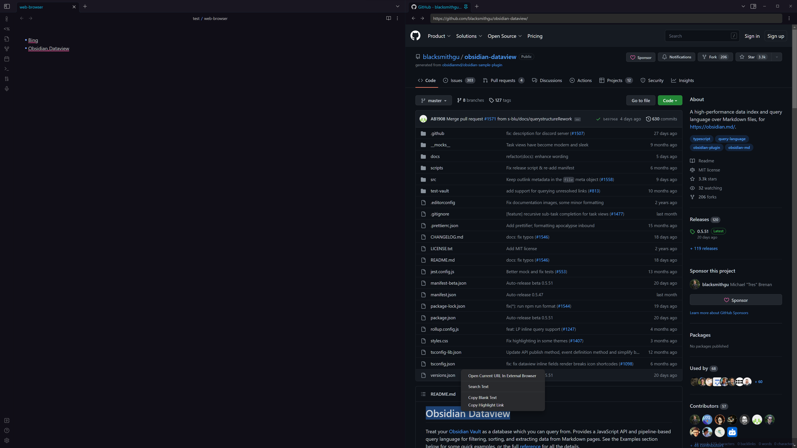

## Surfing

> 这个分支由 Boninall 维护，仅作个人使用。如果你想用该插件，使用 `quorafind/obsidian-surfing` 分支而不是以前的；
> 原始分支来自[这里](https://github.com/Trikzon/obsidian-web-browser)

[English Doc](README.md)

## 简介

这是一款 Obsidian 插件，允许你在 Obsidian v1.0 的标签页中浏览任意网址。

这个插件的核心功能——渲染一个 webview
，离不开 [Ellpeck's Obsidian Custom Frames](https://github.com/Ellpeck/ObsidianCustomFrames) 插件。



## 功能介绍

- 核心功能
	- 浏览任意网页：该插件会劫持Obsidian的 file、http、https 协议，使得链接能直接在Obsidian里打开，而不是外部浏览器。对，本地HTML等资源也支持。
	- 编辑器网页搜索你可以在编辑器选中关键字后，右键在 web-browser 中打开，使用默认的搜索引擎搜索。
	- 网页内网页搜索：同样的，你可以在网页内右键使用默认的搜索引擎搜索。
	- 复制指向高亮的链接：同浏览器一样，你可以选中文字，复制指向该处的链接。
	- 在浏览器中使用书签直接在 Obsidian 中打开网址。
	- 复制视频时间戳(实验性功能：目前仅支持bilibili)：右键文字弹出复制时间戳的菜单，目前有些bug，已知有时弹不出菜单。
- 辅助功能
	- 用外部浏览器打开当前URL：右键菜单
	- 默认搜索引擎：设置项
	- 默认复制高亮的模板：设置项（目前仅支持非常简单的模板），请避免使用一些特殊字符
	- 支持浏览历史记录：前后跳转网页
	- 清除浏览历史记录：命令面板
	- 所有链接都在右侧同一个面板中打开：设置项
	- 切换是否在右侧同一面板中打开：命令面板
	- 简单的夜间模式：主要是为了bilibili的夜间观感，有些瑕疵，问题不大

## 使用方法

### 利用浏览器书签在obsidain中打开网站

插件注册了一个 Obsidain uri 协议，该协议允许你使用`obsidian://web-open?url=<url>`的网址在 Obsidian 中打开 Web-broswer
。其中`<url>`
指网页地址链接。配合 [bookmarklets](https://www.ruanyifeng.com/blog/2011/06/a_guide_for_writing_bookmarklet.html)
便能实现点击浏览器的一个书签，在ob内打开当前浏览器网址。

1. 在插件设置里打开`Open URL In Obsidian Web`选项
2. 该选项下有一个链接，拖拽这个链接到你外部浏览器的书签栏处，会生成一个书签; 你也可以点击这个链接复制 bookmarklets
   代码，自己新建一个书签
3. 现在可以点击书签，将浏览器当前页面在 Obsidian 打开了

## 使用技巧

对于中文用户，你可能希望复制的高亮链接是可以直接显示原文，这种情况下，你可以应用下述的 Quickadd 脚本：

```javascript
selObj = window.getSelection();
text = selObj.toString();
text = await decodeURIComponent(text)
this.quickAddApi.utility.setClipboard(text);

return text;
```

然后粘贴取代原来的文本内容即可。

## 安装

- 目前尚未准备好上架市场
- 可以通过 [Brat](https://github.com/TfTHacker/obsidian42-brat) 插件安装
- 手动安装

1. 在该github页面找到release页面并点击
2. 下载最新的一次release压缩包
3. 解压，复制解压后的文件夹到obsidian插件文件夹下，确保该文件夹里有main.js和manifest.json文件
4. 重启obsidian（不重启也行，得刷新），在设置界面启用该插件
5. 欧了

## Contribution

- [皮皮](https://github.com/windily-cloud) - 中文翻译 && 部分功能实现

## Support

You can support original author `Trikzon` :

[](https://ko-fi.com/trikzon)
